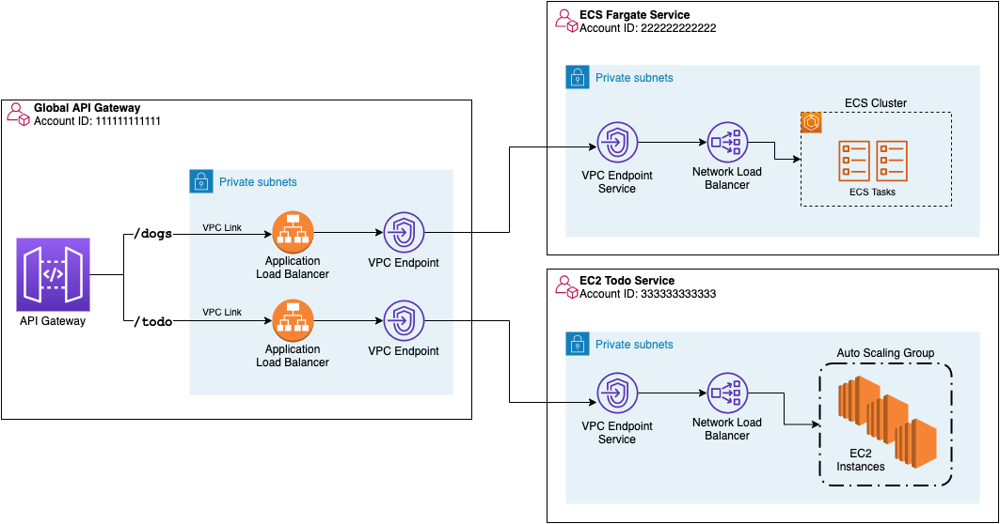

# Private cross-account APIs with Amazon API Gateway and AWS PrivateLink

## Security

See [CONTRIBUTING](CONTRIBUTING.md#security-issue-notifications) for more information.

## License

This library is licensed under the MIT-0 License. See the LICENSE file.

## Introduction

This repository demonstates an approach to set up a central API Gateway with integrations to multiple
APIs in different AWS accounts, using VPC Endpoints. All of the network traffic from the Central
HTTP ApiGateway is private, using PrivateLink via the VPC Endpoints and VPC Endpoint Services
which are created in the providing accounts.

This can best be understood with an architecture diagram:



Some advantages of this design are:

- All network traffic from the `Global API Gateway Account` to different provider accounts is kept within
  the AWS network. That is, network traffic is never exposed to the public internet.
- Using a centrally managed API Gateway, users can manage authentication, rate limiting and other
  tasks in one place, allowing the backend API providers to focus on application logic.
- This pattern is extensible to any system that you can put behind a Network Load Balancer.

## Requirements

This project uses the Python version of CDK. You will need to have a Python development system setup with Python 3.6+.For testing purposes it's easiest to create a single virtual environment in the root of this project and share all dependencies. This project is set up like a standard Python project. The initialization process also creates a virtualenv within this project, stored under the `.venv` directory. To create the virtualenv it assumes that there is a `python3` (or `python` for Windows) executable in your path with access to the `venv` package. If for any reason the automatic creation of the virtualenv fails, you can create the virtualenv manually.

To manually create a virtualenv on MacOS and Linux:

```
$ python3 -m venv .venv
```

After the init process completes and the virtualenv is created, you can use the following
step to activate your virtualenv.

```
$ source .venv/bin/activate
```

If you are a Windows platform, you would activate the virtualenv like this:

```
% .venv\Scripts\activate.bat
```

Once the virtualenv is activated, you can install the required dependencies.

```
$ pip install -r requirements.txt
```

To add additional dependencies, for example other CDK libraries, just add
them to your `setup.py` file and rerun the `pip install -r requirements.txt`
command.

## Quickstart

If you already have Python and virtualenv setup, you can start from here.

```bash
$ # after creating a virtual environment
$ pip install -r requirements.txt
```

## Setup

These three CDK stacks are designed to work together but require _three_ AWS accounts. The following
example AWS Account IDs are used in this documenation to create the stacks:

- global-apigw: `111111111111`
- ecs-provider: `222222222222`
- ec2-provider: `333333333333`

<div style="background-color:rgb(255,165,0); text-align: center; vertical-align: middle; padding:20px; margin-bottom:10px;">
   <p>
      <strong>Make sure to follow these instructions when creating or destroying resources!</strong>
   </p>
   Due to the integrations between the API Gateway stack and API providers (EC2 and ECS) you must set
   a few variables in order for each stack to successfully deploy. There is also an order of
   operations when creating or destroying stacks.
</div>

Once your virtualenv has been created and you've installed the requirements you can create the
different stacks in the following order. Follow the instructions in each `README` for
the component projects.

1. [ecs-provider](ecs-provider)
1. [ec2-provider](ec2-provider)
1. [global-apigw](global-apigw)

## Directory layout

There are a few directories which work together to build the full solution.

Each directory contains CDK code to set up one of the three components. Each component is comprised
of multiple CloudFormation stacks using CDK. Each component will setup a new VPC with a NAT Gateway
along with public and private subnets and other VPC parts.

- `apigw-vpce-helpers` - Common code which is shared across the stacks below
- `ec2-provider` - CDK Stack which creates an Autoscaling Group of EC2 instances. The application is
  implemented in Python using Flask and DynamoDB. This mimics a simple TODO application and supports
  reading and writing data.
- `ecs-provider` - CDK Stack which creates an ECS Fargate service. The application is implemented in
  GO and is a read-only API which returns dog names.
- `global-apigw` - CDK Stack which creates an HTTP API Gateway with integrations to the `ec2-provider`
  and `ecs-provider`. `https` requests to the public HTTP API Gateway endpoint are routed to the
  correct backend provider using a series of
  integrations as can be seen in the network diagram above, and explained below.

  - API Gateway Account: `https request -> API Gateway -> VPC Link -> Application Load Balancer in private subnet -> VPC Endpoint`
  - Integration Accounts: `VPC Endpoint Service -> Network Load Balancer in private subnet -> Compute target (EC2, ECS)`

<div style="background-color:rgb(255,165,0); text-align: center; vertical-align: middle; padding:20px; margin-bottom:10px;">
   One AWS account needs to be dedicated to the <code>global-apigw</code> stack. The account used to deploy
   this stack should <strong>not</strong> be used to deploy other stacks.

Using one account to deploy both `ec2-provider` and `ecs-provider` is fine.

</div>

## Useful commands

- `cdk ls` list all stacks in the app
- `cdk synth` emits the synthesized CloudFormation template
- `cdk deploy` deploy this stack to your default AWS account/region
- `cdk diff` compare deployed stack with current state
- `cdk docs` open CDK documentation

Enjoy!
